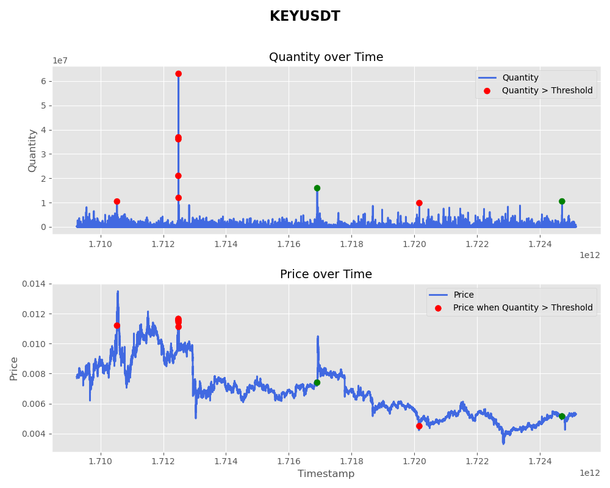

# Analyzing the Effects of Market Structure and Large Trades on Short-Term Cryptocurrency Price Movements with Machine Learning
Authors: Frolov M.K. Zhizhin N.Y.

# Contents

<!-- TOC start (generated with https://github.com/derlin/bitdowntoc) -->

- [1. Introduction](#1-introduction)
- [2. Research Questions](#2-research-questions)
- [3. Literature Review](#3-literature-review)
   * [Cryptocurrency Market Microstructure: A Systematic Review  ](#cryptocurrency-market-microstructure-a-systematic-review)
   * [On the Drivers of Cryptocurrency Liquidity: The Case of Bitcoin  ](#on-the-drivers-of-cryptocurrency-liquidity-the-case-of-bitcoin)
   * [Cryptocurrency Trading: A Comprehensive Survey  ](#cryptocurrency-trading-a-comprehensive-survey)
   * [Market Efficiency of Cryptocurrency: Insights from the Bitcoin Market  ](#market-efficiency-of-cryptocurrency-insights-from-the-bitcoin-market)
- [4. Methodology](#4-methodology)
   * [4.1 Data Collection  ](#41-data-collection)
   * [4.2 Feature Engineering  ](#42-feature-engineering)
   * [4.3 Model Selection  ](#43-model-selection)
   * [4.4 Model Evaluation  ](#44-model-evaluation)
- [5. Expected Results](#5-expected-results)
- [6. Contributions](#6-contributions)
- [7. Conclusion](#7-conclusion)
- [References](#references)
- [Plots and graphs](#plots-and-graphs)

<!-- TOC end -->

<!-- TOC --><a name="1-introduction"></a>
# 1. Introduction

Cryptocurrency markets are known for their high volatility, driven by various factors, including the structure of the market itself. Elements like large trades and the depth of the order book can play a big role in how prices move. While there’s been plenty of research into long-term price trends, not much attention has been paid to how these micro-level factors affect short-term price changes in smaller cryptocurrencies.

The goal of this research is to explore how large trades and other market microstructure metrics influence the short-term price movements of small-cap cryptocurrencies. We’ll use machine learning to predict cryptocurrency returns over short time frames, like 1 to 5 minutes, and investigate the relationships between different market features and price behavior.

<!-- TOC --><a name="2-research-questions"></a>
# 2. Research Questions

- **RQ1:** How do large trades impact short-term price movements in small-cap cryptocurrencies?
- **RQ2:** Which market microstructure metrics (like volume imbalance, trade size, or order book depth) are the best predictors of short-term returns?
- **RQ3:** Can machine learning models accurately predict short-term returns of small-cap cryptocurrencies using trade and order book data?

<!-- TOC --><a name="3-literature-review"></a>
# 3. Literature Review

<!-- TOC --><a name="cryptocurrency-market-microstructure-a-systematic-review"></a>
## Cryptocurrency Market Microstructure: A Systematic Review  
This paper reviews the existing research on how cryptocurrency markets function, analyzing 138 studies to pinpoint trends and gaps in the current understanding. It highlights the importance of understanding market dynamics for researchers, investors, and regulators.  
[Read more](https://link.springer.com/article/10.1007/s10479-023-05627-5)

<!-- TOC --><a name="on-the-drivers-of-cryptocurrency-liquidity-the-case-of-bitcoin"></a>
## On the Drivers of Cryptocurrency Liquidity: The Case of Bitcoin  
This study looks at what affects Bitcoin’s liquidity by analyzing high-frequency data. It identifies key factors that contribute to the liquidity of Bitcoin and similar cryptocurrencies.  
[Read more](https://jfin-swufe.springeropen.com/articles/10.1186/s40854-023-00598-9)

<!-- TOC --><a name="cryptocurrency-trading-a-comprehensive-survey"></a>
## Cryptocurrency Trading: A Comprehensive Survey  
This survey examines 146 studies on various aspects of cryptocurrency trading, including trading strategies, platforms, and risk management, summarizing the research so far and suggesting future directions.  
[Read more](https://jfin-swufe.springeropen.com/articles/10.1186/s40854-021-00321-6)

<!-- TOC --><a name="market-efficiency-of-cryptocurrency-insights-from-the-bitcoin-market"></a>
## Market Efficiency of Cryptocurrency: Insights from the Bitcoin Market  
This research explores whether Bitcoin adheres to the weak-form efficient market hypothesis, using a quantum harmonic oscillator model to provide insights into the market’s efficiency.  
[Read more](https://www.nature.com/articles/s41598-023-31618-4)

<!-- TOC --><a name="4-methodology"></a>
# 4. Methodology

<!-- TOC --><a name="41-data-collection"></a>
## 4.1 Data Collection  
We’ve gathered tick-level trade data for 76 cryptocurrencies from Binance. The data is organized in CSV format, where each row represents a single trade on the platform. The columns include:

- **Trade ID**: A unique identifier for each trade.
- **Price**: The price at which the trade happened.
- **Quantity**: How much was traded.
- **Quote Quantity**: The value of the trade in the quote currency (price × quantity).
- **Timestamp**: The time the trade occurred (in Unix timestamp format).
- **Buyer is Maker**: Whether the buyer initiated the trade (true) or the seller did (false).
- **Best Match**: Whether the trade was the best possible match at that moment (true/false).

<!-- TOC --><a name="42-feature-engineering"></a>
## 4.2 Feature Engineering  
We will extract the following features from the raw trade data:
- **Trade Size**: How big each trade was.
- **Trade Direction**: Whether the trade was a buy or sell order.
- **Volume Imbalance**: The difference between buy and sell volumes within a certain time window.
- **Price Impact**: How much the price changes after large trades.
- **Order Book Depth**: How much liquidity exists at different price levels.
- **Volatility**: A rolling measure of price variation.
- **Momentum**: Short-term trends in price and volume.

We’ll predict short-term returns, which will be calculated as:

$$r_t = \frac{P_{t + \Delta_t} - P_t}{P_t}$$

where $P_t$ is the price at time $t$, and $\Delta_t$ is the prediction window (1, 5, or 10 minutes).

<!-- TOC --><a name="43-model-selection"></a>
## 4.3 Model Selection  
We’ll try several machine learning models, both for regression and classification:
- **Linear Models** (Lasso, Ridge) to set a baseline.
- **Tree-based Models** (Random Forest, XGBoost) to capture non-linear relationships.
- **Recurrent Neural Networks (RNNs) / LSTMs** to model the time dependencies in trade sequences.
- **Gradient Boosting Models** (LightGBM) for handling high-dimensional tabular data.

<!-- TOC --><a name="44-model-evaluation"></a>
## 4.4 Model Evaluation  
- **Metrics**: For regression models, we’ll use Mean Squared Error (MSE) and Mean Absolute Error (MAE). For classification models, we’ll focus on Precision and Recall.
- **Backtesting**: We’ll test the models on historical data to evaluate their predictive power in simulated trading scenarios.

<!-- TOC --><a name="5-expected-results"></a>
# 5. Expected Results

We expect the following outcomes:
- Large trades will have a noticeable impact on short-term price movements, especially in smaller cryptocurrencies that have less liquidity.
- Machine learning models, particularly non-linear ones such as XGBoost or LSTMs, will outperform simpler models in predicting short-term returns.
- Features like volume imbalance and order book depth will likely be strong indicators of short-term price changes.

<!-- TOC --><a name="6-contributions"></a>
# 6. Contributions

This research will provide insights in several areas:
- **Cryptocurrency Market Dynamics**: Shedding light on how large trades and market structure impact the price of small-cap cryptocurrencies.
- **Financial Machine Learning**: Applying machine learning to predict short-term cryptocurrency returns based on high-frequency trade data.
- **Market Microstructure Theory**: Extending the theories developed in traditional finance to the cryptocurrency space.

<!-- TOC --><a name="7-conclusion"></a>
# 7. Conclusion

Understanding how market microstructure affects cryptocurrency prices is key to building better trading strategies. This research will use machine learning to predict short-term returns by analyzing the effects of large trades and other market structure factors.

---

<!-- TOC --><a name="references"></a>
# References

1. [Market Microstructure Review](https://link.springer.com/article/10.1007/s10479-023-05627-5)
2. [Bitcoin Liquidity Study](https://jfin-swufe.springeropen.com/articles/10.1186/s40854-023-00598-9)
3. [Cryptocurrency Trading Survey](https://jfin-swufe.springeropen.com/articles/10.1186/s40854-021-00321-6)
4. [Market Efficiency in Bitcoin](https://www.nature.com/articles/s41598-023-31618-4)

<!-- TOC --><a name="plots-and-graphs"></a>
# Plots and graphs

Table1. Sample Data Typization

```
<class 'pandas.core.frame.DataFrame'>
RangeIndex: 11272102 entries, 0 to 11272101
Data columns (total 8 columns):
 #   Column         Dtype  
---  ------         -----  
 0   TradeID        int64  
 1   Price          float64
 2   Quantity       float64
 3   QuoteQuantity  float64
 4   Timestamp      int64  
 5   BuyerIsMaker   bool   
 6   BestMatch      bool   
 7   Currency       object 
dtypes: bool(2), float64(3), int64(2), object(1)
memory usage: 537.5+ MB
```

Table2. Sample Data Descriptive Statistics

| Statistic   | TradeID          | Price             | Quantity          | QuoteQuantity     | Timestamp         |
|-------------|------------------|-------------------|-------------------|-------------------|-------------------|
| count       | 1.127210e+07     | 1.127210e+07      | 1.127210e+07      | 1.127210e+07      | 1.127210e+07      |
| mean        | 4.980914e+07     | 8.602184e-03      | 1.168843e+04      | 9.589368e+01      | 1.713589e+12      |
| std         | 3.253976e+06     | 2.070797e-03      | 5.203954e+04      | 4.691609e+02      | 4.111717e+09      |
| min         | 4.417308e+07     | 3.295000e-03      | 1.000000e+00      | 3.351000e-03      | 1.709251e+12      |
| 25%         | 4.699111e+07     | 7.152000e-03      | 8.970000e+02      | 7.545010e+00      | 1.710559e+12      |
| 50%         | 4.980914e+07     | 8.677000e-03      | 2.829000e+03      | 2.275390e+01      | 1.711732e+12      |
| 75%         | 5.262716e+07     | 1.001800e-02      | 9.424000e+03      | 7.700261e+01      | 1.716446e+12      |
| max         | 5.544519e+07     | 1.350100e-02      | 6.300000e+07      | 7.194600e+05      | 1.725149e+12      |

Figure1. Sample Diagram



